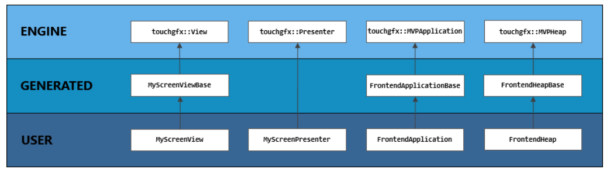

# UI Development - Fundamentals - Hands on

Prensentation document link: https://sw-center-st-com.s3-eu-west-1.amazonaws.com/touchgfx/doc/presentation/ui-development-fundamentals/ui-development-fundamentals-presentation.pdf

## Software architecture

- The screen concept

- Code Structure

Engine: the library; Gnerated: XxxxBase.cpp; 

The generated code example: setting up a screen

- Simulator

3 ways to run the siulator:
1. From TouchGFX designer
2. From TouchGFX Environment
3. From Visual Studio.

- DebugPrinter (is used to print text on top of the screen)

- Custom Triggers and Actions

- MIXINS

- Everything done in the Designer can also be done in user code. 

# END