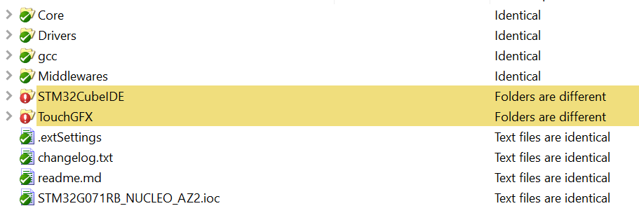
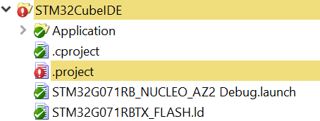
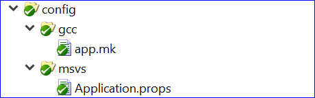
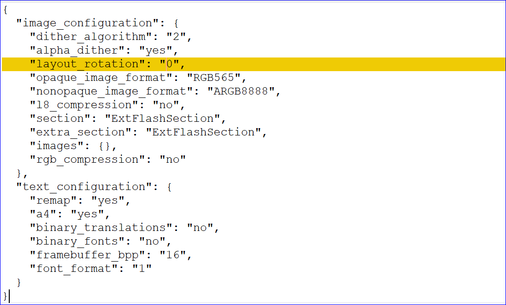

# Compare Two New Project

Here I compare two project, one is the rice cooker demo, one is an empty project I created from Designer with G071B board setup. They are compared after I compiled and flashed the board. Those two projects use the same hardware, the difference is that the 'empty' one is almost empty with user code.

## I use WinMerge to compare the two folders

From the comparing result, most are identical, differences are only in STM32CubeIDE and TouchGFX folders.

### 1. The IDE folders have little difference

Note that, the .project stores all the file paths for the project, .cproject stores the configuration for the project.

### 2. The TouchGFX folders have more difference

1. `App/app_touchgfx.c/h` has the main touchgfx entry for main(), code is simple and stays all the same across projects.

2. `assets` store all the media resources for the project.

3. `build` holds all the project outputs

4. `config` for touchgfx in those two are same 

5. `generated` folders are different, since it holds the source and media data

6. `gui` is half generated and half user coded, it holds all the screens source code, e.g. `screen1Presenter.cpp/.hpp`, `screen1View.cpp/hpp`.

7. `simulator` is different, because `simulator` compiles the source code files, it means different paths set.

8. `target` holds the Designer's setting for the board

application.config:

`.touchgfx.part` set the starting point of the project for Designer

`target.config` looks like part of the `.touchgfx.part`.

#This is The End