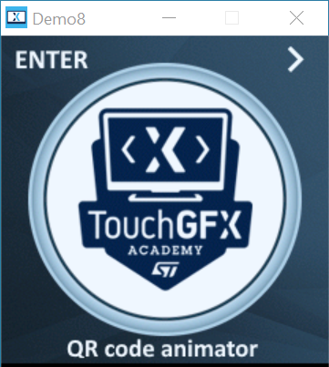
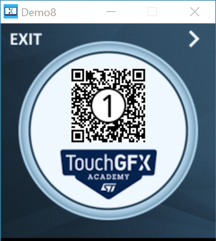
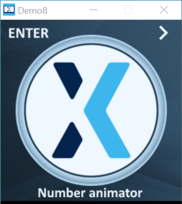
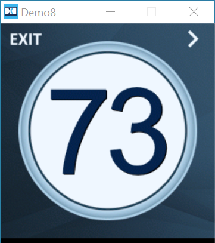
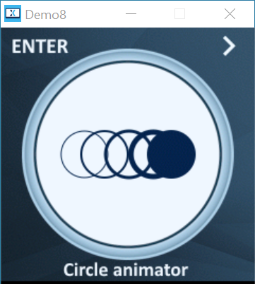
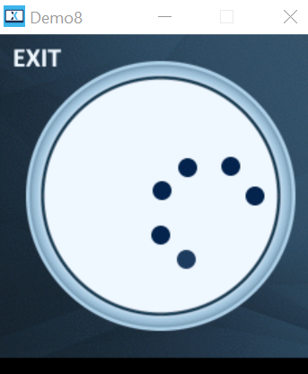
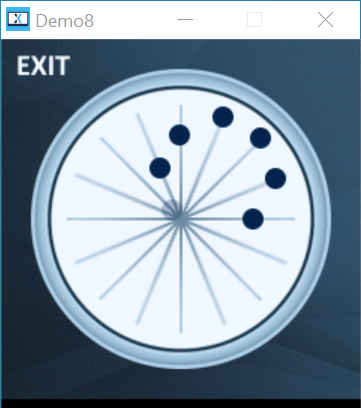

# G071B Demos

## Demo8 (Excellent effects)

It has 3 demos, shown in the table below.

|Demo item| Effects | 
|:--|:---|
|QR code |  |
|Number Animation |    |
|Circle Animation |   |

## 2.Folder structure
Let's look at what are all the files in this project. There're quite a lot of them. 

- Core
	- DCS.h [Display Command Set definition]
	- main.h/.c
	- MB1642ButtonController.hpp/cpp
	- MB1642DataReader.h/.c
	- MB1642DisplayDriver.h/.c
	- RTE_Components.h
	- stm32g0xx_hal_config.h
	- stm32g0xx_it.h/.c
	- stm32g0xx_hal_msp.c
	- system_stm32g0xx.c
- Drivers
    - CMSIS
        - Device/ST/STM32G0xx/Include
            - stm32g0xx.h, stm32g071xx.h, system_stm32g0xx.h
        - Include/: core_cm0.h, cmsis_armcc.h, ... a lot
    - STM32G0xx_HAL_Driver
        - stm32g0xx_hal.c, cortex.c, crc.c, dma.c, exit.c, gpio.c, ... 
- gcc
    - Makefile
    - MX25L6433F_GFX01M2_STM32G0.stldr [use ST-LINK to program external flash]
    - startup_stm32g071rbtx.s
    - STM32G071RBTX_FLASH.ld
    - syscalls.c, sysmem.c
    - include/: cube_programmer.mk, flash_sections_int_ext.mk
- Middlewares\ST\touchgfx
    - 1.3rdparty/libjpeg
    - 2.framework
        - platform
            - driver/touch: SDL2TouchController.cpp
            - hal/simulator/sdl2: HALSDL2.cpp, HALSDL2_icon.cpp, OSWrappers.cpp. [Simple DirectMedia Layer, is an engine for simulator]
        - touchgfx [a lot of .cpp files.]
            - containers
            - widgets
        - tools [some .exe and .out files]
            - fontconvert
            - imageconvert
            - textconvert
            - videoconvert 
    - 3.lib
        - core/cortex_m0/gcc/ : libtouchgfx.a
        - linux/: libtouchgfx.a
        - sdl2 / .a and .dll files
        - win / .a and .lib files
    - 4.os/ : OSWrappers.cpp, OSWrappers_cmsis.cpp
- STM32CubeIDE
    - Application/User
        - Core/: syscalls.c, sysmem.c
        - Startup/: startup_stm32g071rbtx.s
    - .cproject, .project [.project = who/what the project is  ;  .cproject = config how it's built (toolchain, flags, memory layout, etc.)]
    - STM32G071RB_NUCLEO_AZ2 Debug.launch [This file tells STM32CubeIDE how to load, connect to, and debug your firmware on the target STM32 microcontroller.]
    - STM32G071RBTX_FLASH.ld
- TouchGFX
    - 1.App
        - app_touchgfx.c/.h
    - 2.asset
        - fonts
            - verdana.ttf
            - NotoSans-Regular.ttf
        - image
            - small_circle.png
        - texts
            - texts.xml
    - 3.build
        - bin 
            - application.map, extflash.bin, intflash.hex, target.hex, simulator.exe
        - MINGW32_NT-6.2
            - a lot of .d and .o files
        - STM32G071RB_NUCLEO_AZ2
            - a lot of .d and .o files
    - 4.config
        - app.mk
        - Application.props  config the paths
    - 5.generated
        - a lot of files, MainViewBase.cpp, container/ImageAnimatiorBase.cpp, ... 
    - 6.gui
        - src
            - common/FrontendApplication.cpp
            - containers/ImageAnimator.cpp
            - main_screen/MainView.cpp, MainPresenter.cpp
            - model/Model.cpp
    - 7.simulator
        - msvs/ Application.sln
        - gcc/Makefile
    - 8.target
        - STM32TouchController.cpp/hpp, TouchGFXDataReader.cpp/hpp, TouchGFXGPIO.cpp, TouchGFXHAL.cpp/hpp
        - generated
            - OSWrapper.cpp, STM32DMA.cpp/hpp, TouchGFXConfiguration.cpp, TouchGFXGneratedDataReader.cpp/hpp, TouchGFXGeneratedHAL.cpp/hpp
STM32G071RB_NUCLEO_AZ2.ioc

## What cpp knowledge do the .cpp files include? 
- review all the .hpp files
- review all the .cpp files

