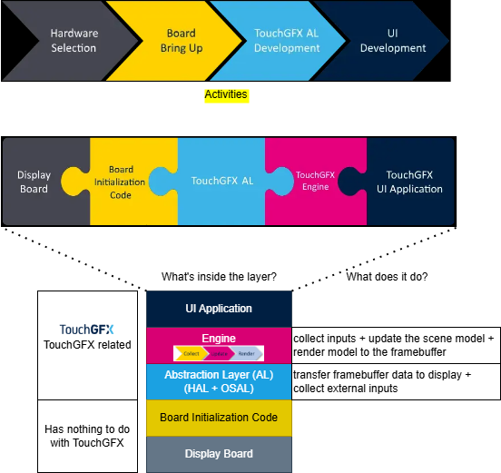

# S18_TouchGFX
Notes and templates for TouchGFX on STM32G/F/H series

## Contents

## Basic Concepts
1. `LTDC` =  LCD-TFT Display Controller. `TFT`=Thin-Film-Transistor, `LCD`=Liquid-Crystal-Display. 
2. `Chrom-ART` = DMA2D or 2D DMA, naming is arbitary.  Its hardware can do Color filling, Image copying, Pixel format conversion, Alpha blending while copying memory data.
3. `FMC` = Flexible Memory controller
4. `FSMC` = Flexible Static Memory Controller
5. `MIPI` = (Mobile Industry Processor Interface) 
	MIPI DSI = Display Serial interface
	MIPI CSI = Camera Serial Interface
6. `AL` = Abstraction Layer 
7. `application` = screens, widgets
8. `Data Reader` = serial flash, a non-memory mapped flash

## The TouchGFX CAN and CANNOT Facts
1. Does NOT support multiple touch.
1. You should expect that this Bring-up phase will take some days to complete.
1. Bring-up does NOT involve any TouchGFX code.
1. CubeMX generates those code contents : 1. startup code to MCU 2. interrupt table, 3 system initialization code, 4 HAL drivers for all the peripherals in the MCU. 5. linker script
1. It's better to disable the data cache in bringing-up phase when you have not got a stable platform. (it can be disabled in CubeMX in the System Core section).
1. Layers are numbered 1, 2 in the HAL functions, but 0, 1 in STM32CubeMX. stupid.

## Overview

## Table Of Contents
1. [Presentation Notes: What are they](./01-reading-notes/presentation1-3/note1.md)
1. [Where does TouchGFX sit in a project?](./01-reading-notes/presentation4/overview.md)
2. [Presentation Notes: What is AL?](./01-reading-notes/3-AL-layer/what-is-AL-in-touchGFX.md)

## Resources
1. CubeIDE All: https://www.st.com/en/development-tools/stm32cubeide.html#documentation
