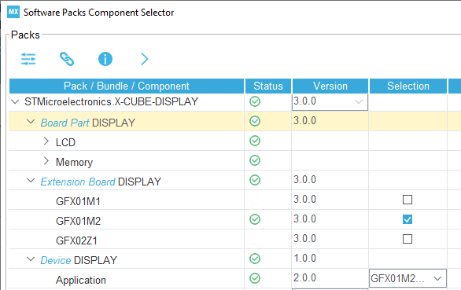
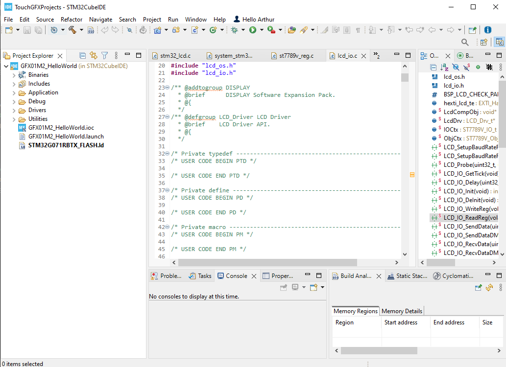
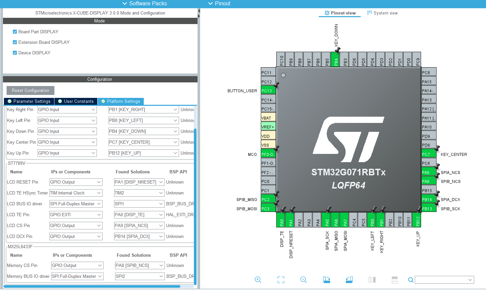

# Pick about 'X-CUBE-DISPLAY'

Key takeaway:

1. You can review the code and see how hardware is connected with TouchGFX lib,
2. This package works with old cubeMx only, like 3.0.0 works with cubeMx6.7.0 

## 1. Links
1. Official link [Display module software expansion for STM32Cube](https://www.st.com/en/embedded-software/x-cube-display.html)
1. Flyer: [microcontrollers-stm32-entry-level-graphics.pdf](https://www.st.com/resource/en/product_presentation/microcontrollers-stm32-entry-level-graphics.pdf)
2. [Getting started with the X-CUBE-DISPLAY STM32Cube Expansion Package.pdf](https://www.st.com/resource/en/user_manual/um2787-getting-started-with-the-xcubedisplay-stm32cube-expansion-package-stmicroelectronics.pdf) (I tried this, it used cubeMx6.7.0 very old version, it does not work anymore, just goto the package and use the projects there)

## 2. What does it look like?

